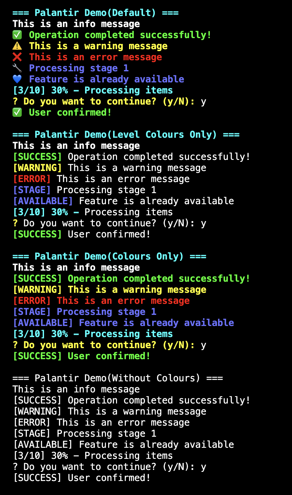

# Palantir

A lightweight Go package for enhanced terminal output, featuring colored text, emoji indicators, and consistent formatting.

> In *The Lord of the Rings* lore, a Palantír is a seeing-stone that enables users to communicate and observe distant events. Similarly, this package empowers you to gain clearer insights into your program's output, making it easier to monitor and understand what's happening.


## Installation

```bash
go get github.com/rocajuanma/palantir
```

## Features

- Multiple output levels
- Colored output: fully-coloured line, level-only or no-colour
- Emoji support
- Progress indicators
- Interactive confirmations


<p align="center">
  
</p>


See the [Palantir terminal demo](cmd/terminal/README.md) for usage examples.
