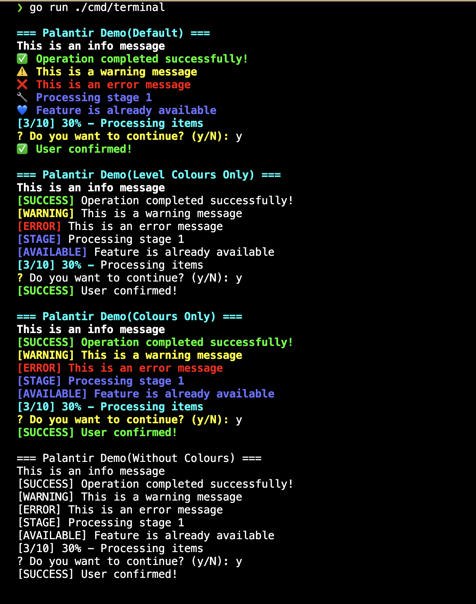

# Terminal Demo

A simple demonstration of the Palantir terminal formatting package.

## Run the Demo

```bash
# From project root(recommended)
go run ./cmd/terminal

# Or build and run
go build -o palantir-demo ./cmd/terminal
./palantir-demo
```

## Output

- Multiple configurations available
- All output levels (Header, Info, Success, Warning, Error, Stage)
- Progress indicators
- Interactive confirmations
- Colour and emoji formatting


<p align="center">
  
</p>


